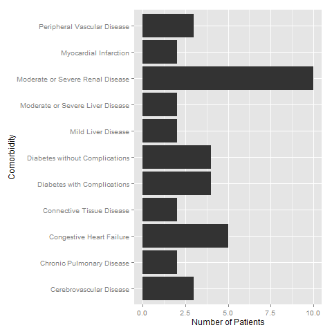

Charlson Comorbidity Index Calculator
=====================================

The Charlson index is a commonly used tool to assess medical commodities, and to adjust for risk in health-care services and research [1][1], [2][2]. 
Electronic medical records(EMR) are widespread today, and diagnosis codes are usually easily extracted from the EMR.
The program here processes ICD9 codes for a given number of patients, and produces a Charlson comorbidity table along with a calculated Charlson score. 

# How to use the program
The program is written in the R programming language [3][3]. It requires `R` to be installed, along with the following packages: `reshape2`, `plyr`, and `ggplot2`.
In order to use the program, you will have to add patient identifiers, along with corresponding ICD9 codes to the `input` folder. With this current built, some test patients are added so that the program can run. Here is what you need to do:

- Replace `Patients1.csv`. This file contains patients identifiers (MRN), date of birth (DOB), and date of hospitalization (DOH). Here is how the file look like: 

```
##   MRN        DOB        DOH
## 1  26 1941-11-30 2014-02-19
## 2  27 1942-07-26 2012-04-14
## 3  28 1959-11-12 2014-03-16
## 4  29 1976-08-10 2014-06-19
## 5  30 1934-09-22 2013-09-17
## 6  31 1936-02-22 2014-01-10
```


- Replace `Patients2.csv`. This file contains the ICD9 codes along with the dates when the diagnoses were made. Here is how the file looks like:

```
##   MRN  ICD9 DiagnosisDate
## 1  26 27541    2013-12-18
## 2  26 27541    2013-12-21
## 3  26 27541    2013-12-24
## 4  26 27541    2013-12-28
## 5  26 27541    2013-12-31
## 6  26 27541    2014-01-01
```


- All the dates should be in the following format: `YYYY-MM-DD`

- ICD9 codes are formatted as series of digits with no spaces or other characters(such as `.`). For example, an ICD9 code of `275.41` or `275 41` or `275-41` should be entered as `27541`. 

- Note also that leading `0` in ICD9 codes are important. For example an ICD9 code of `0021` should not be entered as `21`.

- The program defaults to only accepting ICD9 diagnoses that were made within 5 years of the hospitalization date. However, you can change this by changing the number in `CharlsonRules4.csv` file.

- After you change the files as outlined above, run `CharlsonCalc.R` file. Make sure that the working directory is set to where this file is. You can use `setwd` function to change the working directory. 

# Output
The information is processed, and two files are written to the `output` folder. `Charlson.csv` is a table with the patients, their comorbidities, and their Charlson score. `Graph.png` summarizes the comorbidities for all patients. A snapshot of the output is shown below. Your feedback is always appreciated. Thanks!

 

```
##                                  [,1]    [,2]    [,3]    [,4]    [,5]   
## MRN                              "26"    "27"    "28"    "29"    "30"   
## Myocardial Infarction            "FALSE" "FALSE" "FALSE" "FALSE" " TRUE"
## Congestive Heart Failure         "FALSE" " TRUE" "FALSE" "FALSE" " TRUE"
## Peripheral Vascular Disease      " TRUE" "FALSE" "FALSE" "FALSE" "FALSE"
## Cerebrovascular Disease          "FALSE" " TRUE" " TRUE" "FALSE" "FALSE"
## Dementia                         "FALSE" "FALSE" "FALSE" "FALSE" "FALSE"
## Chronic Pulmonary Disease        "FALSE" " TRUE" "FALSE" "FALSE" " TRUE"
## Connective Tissue Disease        "FALSE" " TRUE" "FALSE" "FALSE" "FALSE"
## Peptic Ulcer Disease             "FALSE" "FALSE" "FALSE" "FALSE" "FALSE"
## Mild Liver Disease               "FALSE" "FALSE" " TRUE" "FALSE" "FALSE"
## Diabetes without Complications   "FALSE" "FALSE" " TRUE" "FALSE" "FALSE"
## Diabetes with Complications      "FALSE" "FALSE" " TRUE" " TRUE" "FALSE"
## Hemiplegia or Paraplegia         "FALSE" "FALSE" "FALSE" "FALSE" "FALSE"
## Moderate or Severe Renal Disease "TRUE"  "TRUE"  "TRUE"  "TRUE"  "TRUE" 
## Malignancy without Metastases    "FALSE" "FALSE" "FALSE" "FALSE" "FALSE"
## Lymphoma or Leukemia             "FALSE" "FALSE" "FALSE" "FALSE" "FALSE"
## Moderate or Severe Liver Disease "FALSE" "FALSE" " TRUE" "FALSE" "FALSE"
## Metastatic Solid Tumor           "FALSE" "FALSE" "FALSE" "FALSE" "FALSE"
## AIDS                             "FALSE" "FALSE" "FALSE" "FALSE" "FALSE"
## Charlson Score                   "6"     "9"     "9"     "4"     "8"    
##                                  [,6]    [,7]    [,8]    [,9]    [,10]  
## MRN                              "31"    "32"    "33"    "34"    "35"   
## Myocardial Infarction            "FALSE" "FALSE" " TRUE" "FALSE" "FALSE"
## Congestive Heart Failure         " TRUE" "FALSE" " TRUE" " TRUE" "FALSE"
## Peripheral Vascular Disease      "FALSE" "FALSE" " TRUE" "FALSE" " TRUE"
## Cerebrovascular Disease          "FALSE" " TRUE" "FALSE" "FALSE" "FALSE"
## Dementia                         "FALSE" "FALSE" "FALSE" "FALSE" "FALSE"
## Chronic Pulmonary Disease        "FALSE" "FALSE" "FALSE" "FALSE" "FALSE"
## Connective Tissue Disease        "FALSE" "FALSE" "FALSE" " TRUE" "FALSE"
## Peptic Ulcer Disease             "FALSE" "FALSE" "FALSE" "FALSE" "FALSE"
## Mild Liver Disease               "FALSE" "FALSE" "FALSE" "FALSE" " TRUE"
## Diabetes without Complications   " TRUE" "FALSE" " TRUE" "FALSE" " TRUE"
## Diabetes with Complications      " TRUE" "FALSE" " TRUE" "FALSE" "FALSE"
## Hemiplegia or Paraplegia         "FALSE" "FALSE" "FALSE" "FALSE" "FALSE"
## Moderate or Severe Renal Disease "TRUE"  "TRUE"  "TRUE"  "TRUE"  "TRUE" 
## Malignancy without Metastases    "FALSE" "FALSE" "FALSE" "FALSE" "FALSE"
## Lymphoma or Leukemia             "FALSE" "FALSE" "FALSE" "FALSE" "FALSE"
## Moderate or Severe Liver Disease "FALSE" "FALSE" "FALSE" "FALSE" " TRUE"
## Metastatic Solid Tumor           "FALSE" "FALSE" "FALSE" "FALSE" "FALSE"
## AIDS                             "FALSE" "FALSE" "FALSE" "FALSE" "FALSE"
## Charlson Score                   "8"     "5"     "9"     "5"     "9"
```


[1]: http://www.ncbi.nlm.nih.gov/pubmed/12725876/
[2]: http://www.ncbi.nlm.nih.gov/pubmed/16015512/
[3]: http://www.r-project.org/
